## Quick Info:

Cloud PhotoVault:

A cloud-based image storage application deployed on AWS.

Backend: PHP

Frontend: HTML, CSS

Database: Amazon RDS (MySQL)

Cloud Storage: Amazon S3

Hosting: Amazon EC2

Authentication: IAM Role

Networking: Amazon VPC
<br><br>
<h1 style="text-align: center;">Cloud PhotoVault</h1>

## Project Overview

Cloud PhotoVault is a cloud-based web application that allows users to securely upload and manage images using Amazon Web Services (AWS). The application is hosted on an Amazon EC2 instance, stores image files in Amazon S3, and saves image metadata in an Amazon RDS MySQL database. IAM Roles are used to securely grant AWS service permissions without storing access keys in the application.
<br><br>
## Architecture Diagram


<br><br>
## AWS Services Used

<h3>Amazon EC2</h3>

Amazon EC2 hosts the PHP web application and serves user requests over the internet.

<h3>Amazon RDS (MySQL)</h3>

Amazon RDS stores image metadata, including filenames, original image names, and upload timestamps.

<h3>Amazon S3</h3>

Amazon S3 stores uploaded image files securely and provides scalable cloud storage.

<h3>IAM Role</h3>

An IAM Role is attached to the EC2 instance, allowing the application to securely access Amazon S3 without hardcoding AWS credentials.

<h3>Amazon VPC</h3>

The application resources are deployed inside an Amazon VPC, providing secure networking and communication between AWS services.

<h3>AWS Systems Manager (Session Manager)</h3>

Session Manager provides secure remote access to the EC2 instance without requiring SSH keys.<br><br>

## Features
•User Authentication<br>
•Secure Image Upload<br>
•Image Validation (JPG, JPEG, PNG)<br>
•Maximum Upload Size Validation (5 MB)<br>
•Image Storage in Amazon S3<br>
•Image Metadata Storage in Amazon RDS<br>
•Image Gallery<br>
•Cloud Deployment on Amazon EC2<br>
•IAM Role-Based AWS Authentication<br>
•Responsive User Interface<br><br>


## Technologies Used

<h4>Frontend</h4>
•HTML5<br>
•CSS
<h4>Backend</h4>
•PHP
<h4>Database</h4>
•MySQL (Amazon RDS)
<h4>Cloud Services</h4>
•Amazon EC2<br>
•Amazon S3<br>
•Amazon RDS<br>
•AWS IAM<br>
•Amazon VPC<br>
•AWS Systems Manager
<h4>Development Tools</h4>
•Git<br>
•GitHub<br>
•Composer<br>
•MySQL Workbench<br>
•Visual Studio Code<br><br>

## Project Workflow
User Login<br>
     &darr; <br>
Dashboard<br>
     &darr; <br>
Select Image<br>
      &darr; <br>
Validate Image<br>
(File Type & Size)<br>
      &darr; <br>
Upload Image to Amazon S3<br>
      &darr; <br>
Store Image Metadata in Amazon RDS<br>
      &darr; <br>
Display Images in Gallery<br><br>

## Project Screenshots
<h3>Website</h3>
• Login Page

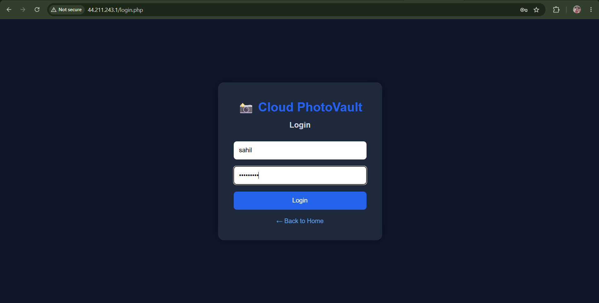
<br><br>
•Dashbaord
 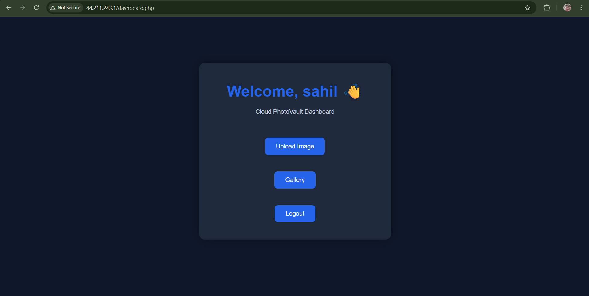
<br><br>
•Upload page
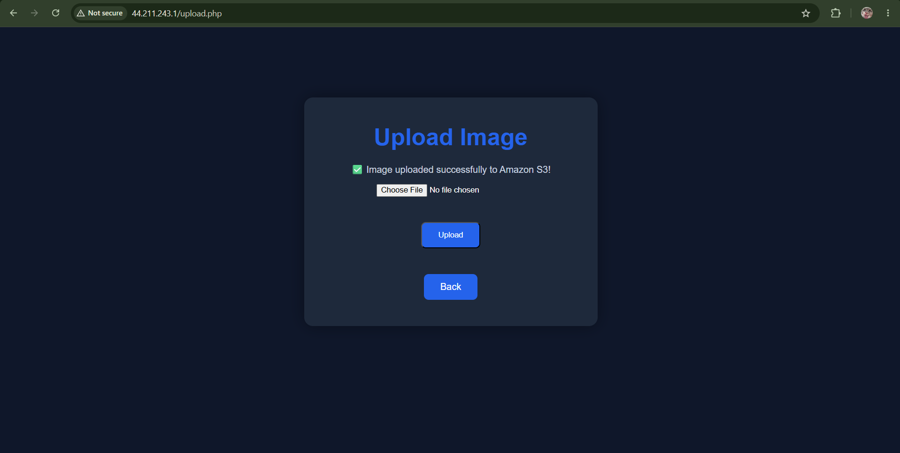
<br><br>
•Gallery
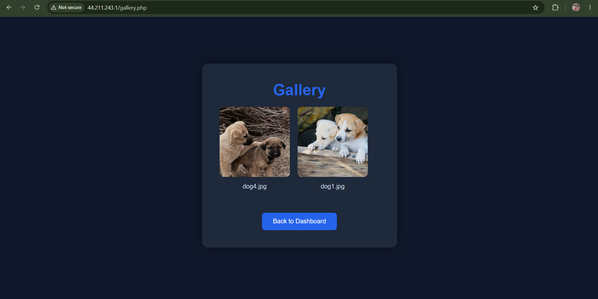
<br><br>
•mainpage
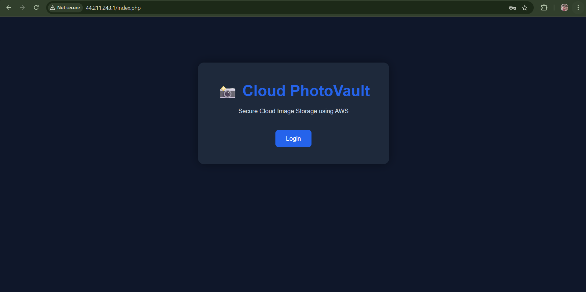
<br><br>

<h3>Amazon EC2</h3>
•EC2 Instance

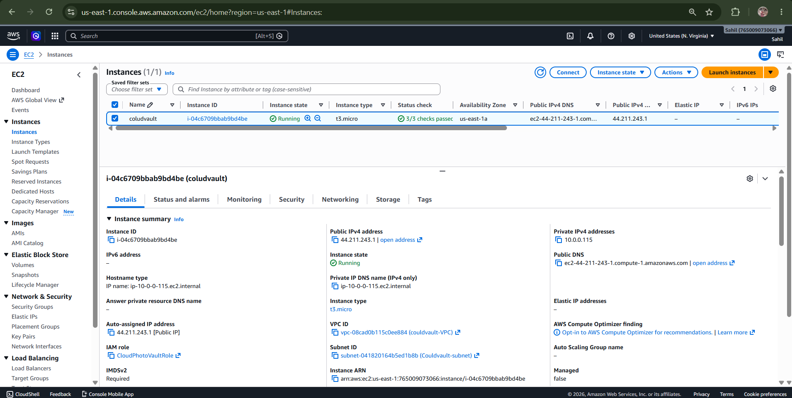

•EC2 Session Manager
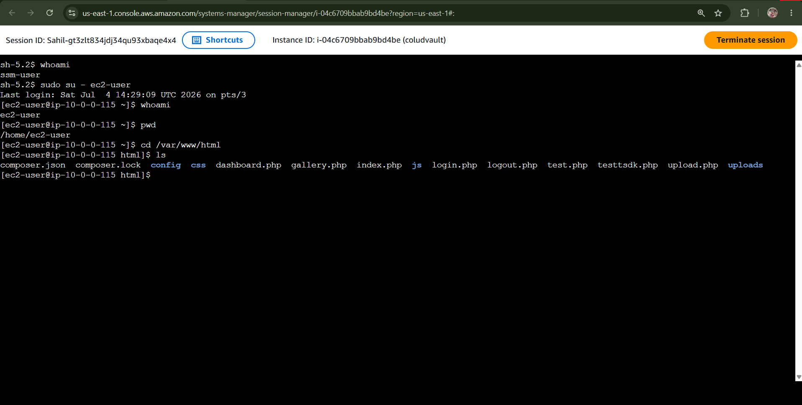
<br><br>

<h3>Amazon S3</h3>
•S3 Bucket

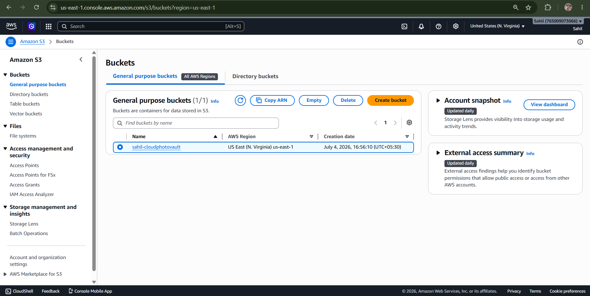

•Uploaded Objects
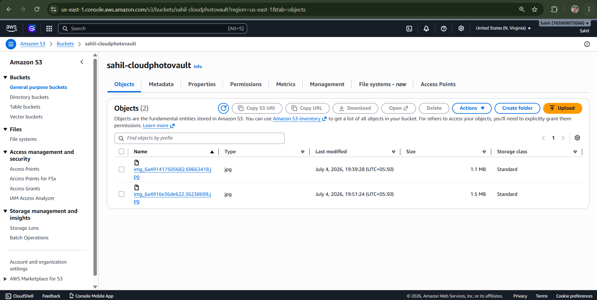
<br><br>

<h3>Amazon RDS</h3>
•Database Overview

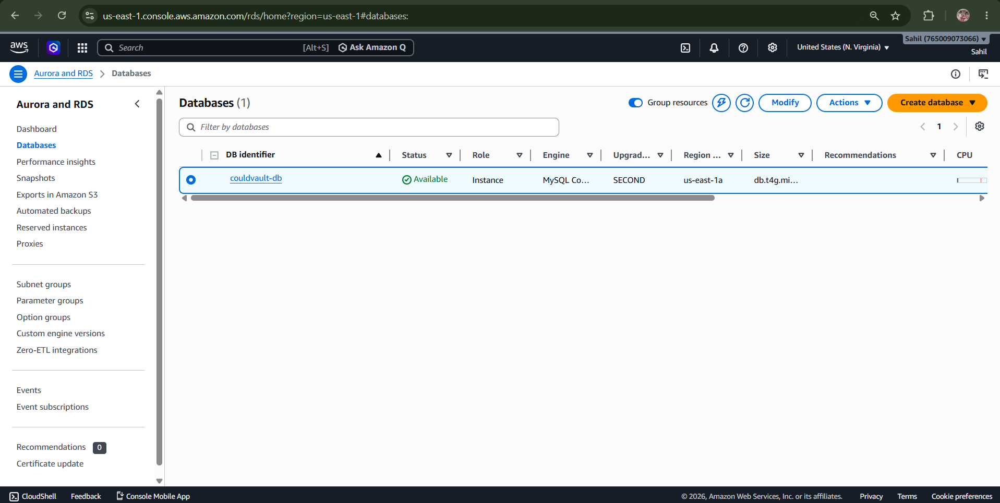

•Database Connectivity

<br><br>

<h3>IAM</h3>
•IAM Role with Attached Policies

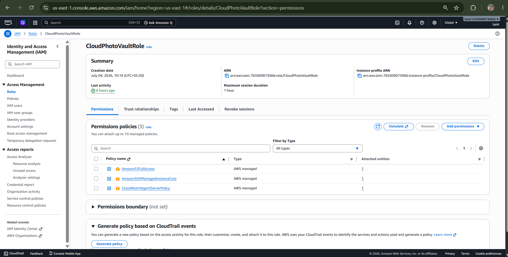
<br><br>

<h3>VPC</h3>
•VPC Resource Map

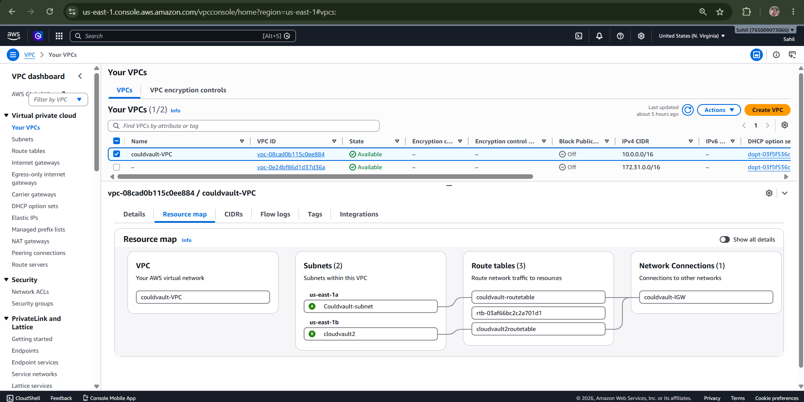
<br><br>

<h3>GitHub</h3>
•repository

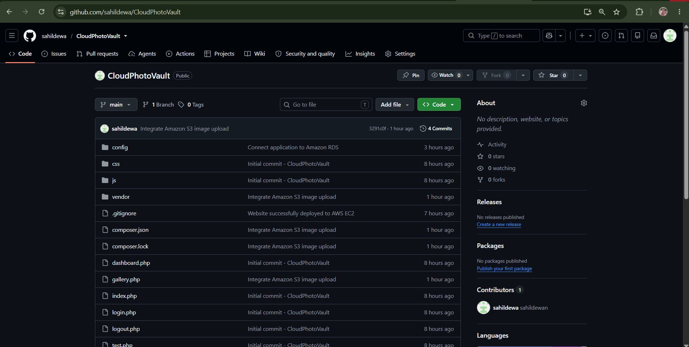
<br><br>

<h3>Database</h3>
•MySQL Workbench

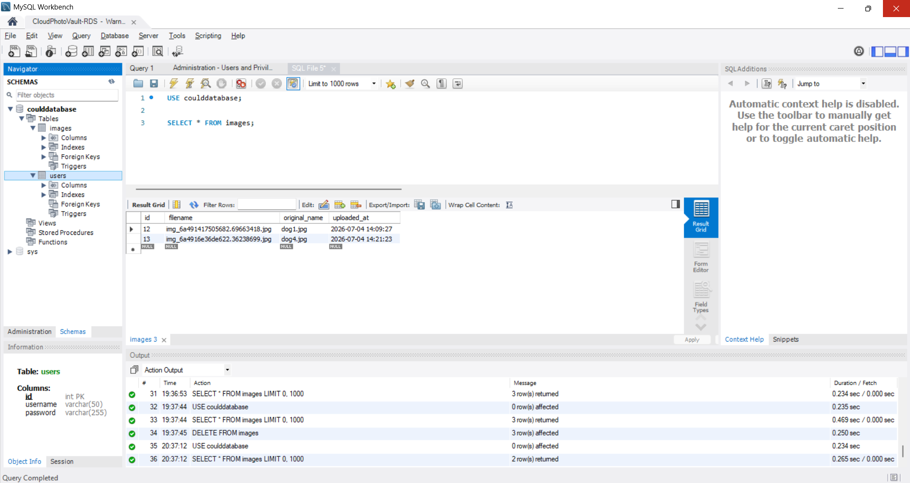
<br><br>

## 📁 Project Structure

```
CloudPhotoVault/
│
├── config/
│   └── database.php
├── css/
│   └── style.css
├── uploads/
├── vendor/
├── dashboard.php
├── gallery.php
├── index.php
├── login.php
├── logout.php
├── upload.php
├── composer.json
├── composer.lock
├── README.md
└── .gitignore
```
## Installation & Deployment
1. Clone the Repository <br>
```git clone <repository-url>```<br><br>
2. Launch an Amazon EC2 Instance<br>
•Install Apache<br>
•Install PHP<br>
•Install Composer<br><br>
3. Create an Amazon RDS MySQL Database<br>
•Configure database credentials<br>
•Import the required SQL schema<br><br>
4. Create an Amazon S3 Bucket<br>
•Enable bucket access<br>
•Configure bucket for image storage<br><br>
5. Create and Attach an IAM Role<br>
Attach permissions for:<br>
•Amazon S3<br>
•AWS Systems Manager<br><br>
6. Configure the Database Connection<br>
Update the database configuration in: <br>
```config/database.php```<br><br>
7. Install Project Dependencies<br>
```composer install```<br><br>
8. Start the Web Server<br>
```sudo systemctl start httpd```<br><br>
9. Access the Application<br>
Open the EC2 Public IP in your web browser.
<br><br>

## Conclusion

Cloud PhotoVault demonstrates the deployment of a PHP-based web application on AWS using Amazon EC2, Amazon RDS, and Amazon S3. The project showcases secure cloud storage, database integration, IAM Role-based authentication, and cloud networking within an Amazon VPC. It highlights practical implementation of core AWS services while following a scalable and secure cloud architecture suitable for modern web applications.